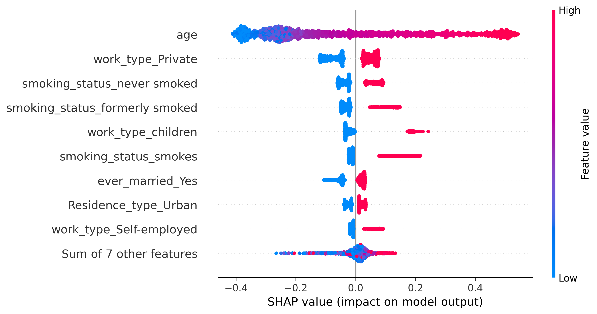
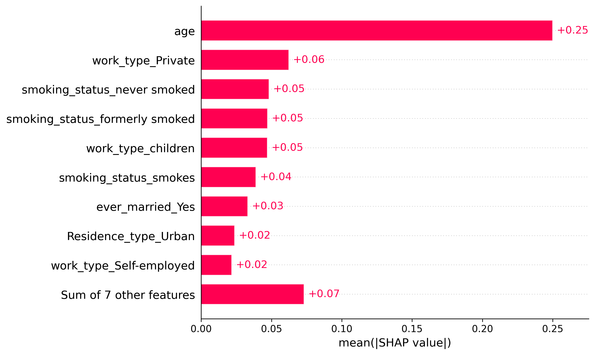

# Stroke Risk Prediction from Population Health Data Using Interpretable Machine Learning

# Overview
This project explores whether classical, interpretable machine learning models can be used to predict stroke occurrence using routinely collected demographic and clinical variables.

The emphasis is placed on handling severe class imbalance, comparing balancing strategies, and maintaining interpretability suitable for biomedical and public health research contexts.

Rather than developing a complex model, the project focuses on understanding trade-offs between sensitivity, specificity, and model transparency in an imbalanced clinical dataset.

# Research Objective
To quantify the discriminative performance of interpretable machine learning models for stroke risk prediction under severe class imbalance.

# Dataset

Source: Brain Stroke Dataset (Kaggle)

Sample size: 5,110 individuals

Target variable: stroke

0 = No stroke

1 = Stroke

Stroke prevalence: ~5%

The dataset is observational and reflects real-world class imbalance typical of stroke incidence.

# Features

-Age

-Hypertension

-Heart disease

-Average glucose level

-Body mass index (BMI)

-Smoking status

-Demographic and socioeconomic indicators

# Methods
Data Preprocessing

  -Removal of non-informative identifiers
  
  -Median imputation for missing BMI values
  
  -One-hot encoding of categorical variables
  
  -Standardization of continuous features
  
  -Stratified train–test split (70/30)
  
  -Handling Class Imbalance

Three strategies were evaluated:

  -Baseline training on the original imbalanced dataset
  
  -Class-weighted logistic regression
  
  -Synthetic Minority Oversampling Technique (SMOTE), applied only to training data

Models

-Logistic Regression
Logistic Regression was used as the primary model due to its interpretability and well-calibrated probabilistic outputs.

-Random Forest
Used as a nonlinear comparator to assess performance trade-offs. Random Forest was included as a nonlinear comparator to assess performance trade-offs relative to interpretable linear models.

# Evaluation

-Primary metric: ROC-AUC

-Secondary metrics: Precision, recall, F1-score

Accuracy is reported but not emphasized due to class imbalance.

# Results
| Model | Balancing Strategy | ROC-AUC | Stroke Recall |
|------|-------------------|--------|---------------|
| Logistic Regression | Class-weighted | ~0.84 | ~0.79 |
| Logistic Regression | SMOTE | ~0.83 | ~0.77 |
| Random Forest | SMOTE | ~0.79 | ~0.17 |

# Key findings:

Logistic Regression achieved substantially higher sensitivity to stroke cases.

Random Forest attained higher overall accuracy but failed to identify most minority-class events.

Accuracy alone is misleading in imbalanced clinical datasets.

# Model Interpretability

Global feature importance was examined using SHAP bar and beeswarm plots.

The most influential predictors of stroke risk were:

-Age

-Average glucose level

-Hypertension

-Heart disease

-Body mass index (BMI)

These findings are consistent with established clinical risk factors, supporting the clinical plausibility of the model.

# Limitations

-Single observational dataset

-Moderate sample size

-No temporal or longitudinal information

-Synthetic oversampling may introduce distributional artifacts

-No external validation cohort was used

# Notes

This project was developed as an exploratory study to build foundational skills in clinical risk modeling and model interpretation.

Reported performance should be interpreted with caution due to dataset size, observational design, and the absence of temporal information.
Interpretability analyses are used for model inspection and plausibility checks, not causal inference.
